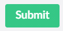

# Button - Standard #

Used for most buttons in the back-office, such as dialog 'Submit' actions.

## Appearance ##

Green with white text, rounded-corners

## Recommended Usage ##

To add a button to a panel or dialog....

[Example best-practice code here, with descriptions of valid options and when they should be used]

----------

----------

## Current Usage in Core ##

[Source code search results...](https://github.com/umbraco/Umbraco-CMS/search?q=%3Cbutton)

###Javascript Directive(s)###

[/src/Umbraco.Web.UI.Client/src/common/directives/components/buttons/umbbutton.directive.js](https://github.com/umbraco/Umbraco-CMS/blob/e9627f2ee962a73cd8c007a42845c9129e3339ee/src/Umbraco.Web.UI.Client/src/common/directives/components/buttons/umbbutton.directive.js)

###Component HTML###

[/src/Umbraco.Web.UI.Client/src/views/components/buttons/umb-button.html](https://github.com/umbraco/Umbraco-CMS/blob/e9627f2ee962a73cd8c007a42845c9129e3339ee/src/Umbraco.Web.UI.Client/src/views/components/buttons/umb-button.html)

###LESS/CSS###

[/src/Umbraco.Web.UI.Client/src/less/components/buttons/umb-button.less](https://github.com/umbraco/Umbraco-CMS/blob/6823cdaaa070921d6b6d2db05c84249000b75fee/src/Umbraco.Web.UI.Client/src/less/components/buttons/umb-button.less)

### Example Usages in Core ###

*An inventory of found usages. Some may be up for changing or represent a different button type, TBD.*

[/src/Umbraco.Web.UI.Client/src/views/common/infiniteeditors/querybuilder/querybuilder.html](https://github.com/umbraco/Umbraco-CMS/blob/e02c417cf8efac549efffb79704160933efc5121/src/Umbraco.Web.UI.Client/src/views/common/infiniteeditors/querybuilder/querybuilder.html)

	<umb-button type="button" button-style="outline" show-caret="true"></umb-button>
	...
	

	
	    <umb-button type="button"
	                button-style="outline"
	                action="vm.contentTypeSelectOpen = !vm.contentTypeSelectOpen"
	                label="{{vm.query.contentType.name}}"
	                show-caret="true">
	    </umb-button>
	
	    <umb-dropdown ng-if="vm.contentTypeSelectOpen" on-close="vm.contentTypeSelectOpen = false">
	        <umb-dropdown-item ng-repeat="contentType in vm.contentTypes">
	            <button type="button" class="btn-reset" ng-click="vm.setContentType(contentType); vm.contentTypeSelectOpen = false;">
	                {{contentType.name}}
	            </button>
	        </umb-dropdown-item>
	    </umb-dropdown>
	
	

	...
	<umb-button type="button"
	            button-style="outline"
	            action="vm.chooseSource(vm.query)"
	            label="{{vm.query.source.name}}">
	</umb-button>
	...
	

	
	    <umb-button type="button"
	                button-style="outline"
	                action="vm.propertyFilterOpen[$index] = !vm.propertyFilterOpen[$index]"
	                label="{{filter.property.name}}"
	                show-caret="true">
	    </umb-button>
	
	    <umb-dropdown ng-if="vm.propertyFilterOpen[$index]" on-close="console.log(1);vm.propertyFilterOpen[$index] = false">
	        <umb-dropdown-item ng-repeat="property in vm.properties">
	            <button type="button" class="btn-reset" ng-click="vm.setFilterProperty(filter, property); vm.propertyFilterOpen[$parent.$parent.$index] = false;">
	                {{property.name}}
	            </button>
	        </umb-dropdown-item>
	    </umb-dropdown>
	
	

	
	

	
	    <umb-button type="button"
	                button-style="outline"
	                action="vm.termFilterOpen[$index] = !vm.termFilterOpen[$index]"
	                label="{{filter.term.name}}"
	                show-caret="true">
	    </umb-button>
	
	    <umb-dropdown ng-if="vm.termFilterOpen[$index]" on-close="vm.termFilterOpen[$index] = false">
	        <umb-dropdown-item ng-repeat="term in vm.getPropertyOperators(filter.property)">
	            <button type="button" class="btn-reset" ng-click="vm.setFilterTerm(filter, term); vm.termFilterOpen[$parent.$parent.$index] = false;">
	                {{term.name}}
	            </button>
	        </umb-dropdown-item>
	    </umb-dropdown>
	
	

	...
	<button type="button" class="btn-reset" ng-click="vm.addFilter(vm.query)">
	    <i class="icon-add" aria-hidden="true"></i>
	</button>
	
	<button type="button" class="btn-reset" ng-click="vm.trashFilter(vm.query, filter)">
	    <i class="icon-trash" aria-hidden="true"></i>
	</button>
	...
	

	
	    <umb-button type="button"
	                button-style="outline"
	                action="vm.sortPropertyOpen = !vm.sortPropertyOpen"
	                label="{{vm.query.sort.property.name}}"
	                show-caret="true">
	    </umb-button>
	
	    <umb-dropdown ng-if="vm.sortPropertyOpen" on-close="vm.sortPropertyOpen = false">
	        <umb-dropdown-item ng-repeat="property in vm.properties">
	            <button type="button" class="btn-reset" ng-click="vm.setSortProperty(vm.query, property); vm.sortPropertyOpen = false;">
	                {{property.name}}
	            </button>
	        </umb-dropdown-item>
	    </umb-dropdown>
	
	

	
	<umb-button ng-show="vm.query.sort.property.name"
	            type="button"
	            button-style="outline"
	            action="vm.changeSortOrder(vm.query)"
	            label="{{vm.query.sort.translation.currentLabel}}">
	</umb-button>
	...
	<umb-editor-footer-content-right>
	
	    <umb-button type="button"
	                button-style="link"
	                label-key="general_close"
	                shortcut="esc"
	                action="vm.close()">
	    </umb-button>
	
	    <umb-button type="button"
	                button-style="success"
	                label-key="general_submit"
	                action="vm.submit(model)">
	    </umb-button>
	
	</umb-editor-footer-content-right>

[/src/Umbraco.Web.UI.Client/src/views/content/protect.html](https://github.com/umbraco/Umbraco-CMS/blob/36af2f6ed25e6c7b2048490b6e49a21f11b6d060/src/Umbraco.Web.UI.Client/src/views/content/protect.html)

	<button type="button" ng-click="vm.pickMember()" class="umb-node-preview-add">
		<localize key="general_add">Add</localize>
	</button>
	...
	<button type="button" ng-click="vm.pickGroup()" class="umb-node-preview-add">
	    <localize key="general_add">Add</localize>
	</button>
	...
	<button type="button" ng-show="!vm.loginPage" ng-click="vm.pickLoginPage()" class="umb-node-preview-add">
	    <localize key="general_add">Add</localize>
	</button>
	...
	<button type="button" ng-show="!vm.errorPage" ng-click="vm.pickErrorPage()" class="umb-node-preview-add">
	    <localize key="general_add">Add</localize>
	</button>
	...
	<umb-button type="button"
	            action="vm.close()"
	            button-style="success"
	            label-key="general_ok">
	</umb-button>
	...
	

	    <umb-button ng-hide="vm.removing"
	                type="button"
	                button-style="link"
	                action="vm.close()"
	                label-key="general_close">
	    </umb-button>
	
	    <umb-button ng-hide="vm.step  || vm.removing"
	                type="button"
	                action="vm.next()"
	                button-style="action"
	                label-key="general_next"
	                disabled="vm.loading || !vm.type">
	    </umb-button>
	
	    <umb-button ng-show="vm.canRemove && !vm.removing"
	                type="button"
	                action="vm.removeProtection()"
	                button-style="warning"
	                label-key="publicAccess_paRemoveProtection"
	                disabled="vm.buttonState === 'busy'">
	    </umb-button>
	
	    <umb-button ng-show="vm.step && !vm.removing"
	                type="button"
	                action="vm.save()"
	                state="vm.buttonState"
	                button-style="success"
	                label-key="buttons_save"
	                disabled="vm.buttonState === 'busy' || !vm.isValid()">
	    </umb-button>
	
	    <umb-button ng-show="vm.removing"
	                type="button"
	                button-style="link"
	                action="vm.close()"
	                label-key="buttons_confirmActionCancel">
	    </umb-button>
	
	    <umb-button ng-show="vm.removing"
	                type="button"
	                action="vm.removeProtectionConfirm()"
	                state="vm.buttonState"
	                button-style="success"
	                label-key="buttons_confirmActionConfirm"
	                disabled="vm.buttonState === 'busy'">
	    </umb-button>
	

[/src/Umbraco.Web.UI.Client/src/views/templates/edit.html](https://github.com/umbraco/Umbraco-CMS/blob/12087e78b759aa89e0af66dcb3d439835edc1f8e/src/Umbraco.Web.UI.Client/src/views/templates/edit.html)

	<button type="button"
	        data-element="button-masterTemplate"
	        class="btn umb-button__button umb-button--xs umb-outline"
	        style="font-size: 14px;"
	        ng-click="vm.openMasterTemplateOverlay()">
	    <localize key="template_mastertemplate">Master template</localize>:
	    
	        {{ vm.getMasterTemplateName(vm.template.masterTemplateAlias, vm.templates) }}
	        <localize key="template_noMaster">No master</localize>
	    
	</button>
	
	<button type="button"
	        class="btn umb-button__button umb-button--xs dropdown-toggle umb-button-group__toggle flex-inline items-center"
	        style="font-size: 14px; height: 100%;"
	        localize="title"
	        title="@general_remove"
	        ng-if="vm.template.masterTemplateAlias"
	        ng-click="vm.removeMasterTemplate()">
	    <umb-icon icon="icon-wrong" class="icon icon-wrong"></umb-icon>
	</button>

[More to Add]